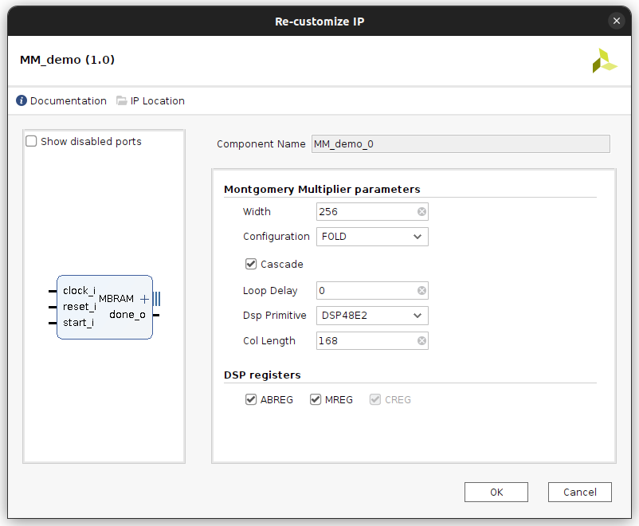

# The Montgomery Multiplication Accelerator

This repository contains HDL sources, implementation projects, verifications utilities and result replication scripts used to generate FPGA hardware Montgomery Multiplication accelerators. The accelerator consists in a systolic design. Its Processing Elements are based on the use of DSP48E2 blocks. The hardware has been developped and explored using the Vivado 2022.1 toolchain. The design is packaged as an IP for ease of use and result replication.

Implementations have been performed using a Zynq Ultrascale+ FPGA (ZCU102 platform, part xczu9eg-ffvb1156-2-e) target. The hardware is designed to communicate with the System on Chip on the development board for Co-design applications.

The implementation and simulation project can be generated using the following command :

`vivado -mode batch -source TCL/FIOS_project_gen.tcl -tclargs ip`

The "ip" / "no_ip" tclargs option will generate the project using either the packaged IP files in the `IP` folder in which case the source cannot be modified on the fly or the files in the `SRC/RTL` folder, in which case modification of the RTL description can be performed directly in the project. This argument defaults to "ip" if tclargs isn't used.

# Verification

Verification utilities for the design are available in the `VERIFICATION` folder. Test vectors can be generated using the [sagemath toolchain](https://www.sagemath.org/) and the gen_test_vectors.sage script (see sage gen_test_vectors.sage -h for help). Test vectors stored in the TXT subfolder are imported to the simulation project of the design by default.

# Vitis Project

A Vitis Project can be automatically created once the `FIOS_project` has been created to directly test the functionnality of the accelerator on the development board in a codesign application using the following command :

`xsct TCL/vitis_FIOS_256_gen.tcl`

This command assumes `FIOS_project` has been used to generate a bitstream with the design configured with `WIDTH=256` and that an `.xsa` exported hardware file has been created.

# Implementation Results

Implementation results can be automatically generated once the project `FIOS_project` has been created using the `TCL/result_database_gen.tcl` script and the following command :

`vivado -mode batch -source TCL/result_database_gen.tcl`

This script will automatically validate the design and generate implementation results for a wide range of different parameters. It will store the implementation results, parameters and simulation results in a database. Although its use is not covered here, a [grafana](https://grafana.com/oss/grafana/) server has been used to vizualize the implementation results data in real-time.
Note that this script uses [sqlite3](https://www.sqlite.org/index.html) and the [tclsqlite](https://cyqlite.sourceforge.io/cgi-bin/sqlite/dir?ci=tip) library installed under `/usr/lib`.

All results are available in the `RESULTS` folder as an sqlite3 database, a csv dump file, and a [markdown table](RESULTS/README.md) for display in github.
